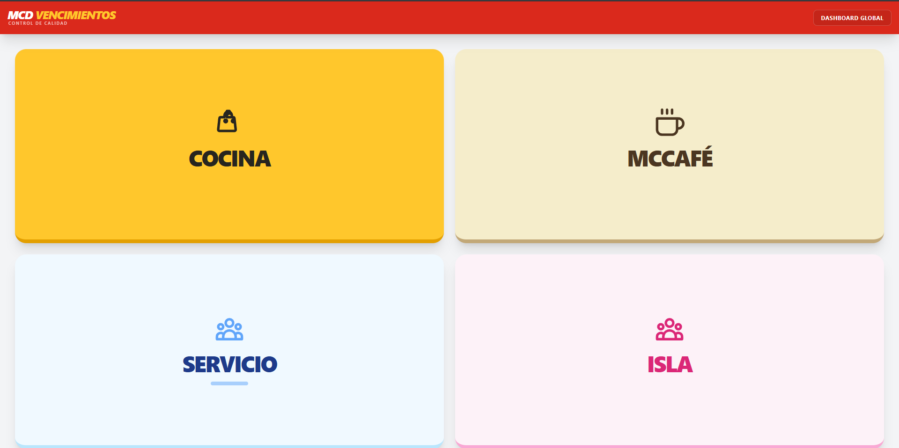
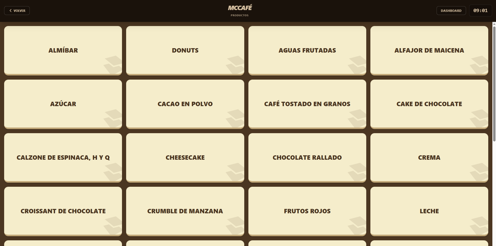

> **Solución Full Stack** diseñada para automatizar el control de vida útil secundaria, impresión de etiquetas y trazabilidad de productos en entornos de comida rápida de alta demanda.

---

## 📸 Capturas de Pantalla




---

## 🚀 Funcionalidades Principales

### 🎛️ Control y Gestión
* **Categorización Inteligente:** Organización por estaciones (Cocina, Servicio, McCafé, etc.) con navegación fluida.
* **Reglas de Vencimiento Dinámicas:** Cada producto tiene su lógica de tiempo asignada.
* **Ajuste Temporal (Offset):** Permite restar horas/minutos/días al vencimiento antes de imprimir, ideal para ajustar el tiempo real de descongelación o apertura.

### 🖨️ Integración de Hardware (IoT)
* **Impresión Térmica Directa:** Conexión con impresoras POS (ESC/POS) para generar etiquetas físicas de trazabilidad al instante.
* **Driver Personalizado:** Configuración específica para detectar la impresora de red o local bajo el alias `"ticketera"`.

### 📊 Dashboard en Tiempo Real
* **Monitor de Estados (Semáforo):** Visualización clara del estado de los productos:
    * 🟢 **Verde:** > 45 minutos de vida útil.
    * 🟡 **Amarillo:** < 45 minutos (Advertencia).
    * 🔴 **Rojo:** < 15 minutos (Peligro).
* **Alertas Sonoras:** Notificación auditiva automática cuando un producto entra en estado crítico (Rojo).
* **Ordenamiento Inteligente:** Los productos próximos a vencer aparecen automáticamente primero.
* **Dashboard Global:** Vista unificada que agrupa los vencimientos activos de las 4 categorías en una sola pantalla de control.

### 🔄 Acciones de Trazabilidad
* **Renovación Rápida:** Reimpresión de etiqueta y reinicio del temporizador con un solo clic.
* **Importación entre Sectores:** Capacidad de compartir un mismo timer (producto) entre diferentes categorías sin duplicar la lógica de vencimiento.
* **Eliminación:** Gestión de mermas y retiro de productos.

---

## 🛠️ Stack Tecnológico


* **Backend:** PHP 8, Laravel (Blade Templates).
* **Frontend:** JavaScript Vanilla (ES6+, DOM Manipulation, Fetch API), Tailwind CSS.
* **Servidor:** Apache (vía XAMPP).
* **Base de Datos:** MySQL.
* **Hardware:** Integración con impresoras térmicas ESC/POS.

---

## ⚙️ Requisitos de Instalación

Para correr este proyecto localmente necesitas:

1.  **PHP 8.1+** instalado.
2.  **Node.js & NPM**.
3.  **Composer**.
4.  **XAMPP** (o cualquier servidor con Apache y MySQL).
5.  **Drivers de Impresora:** Drivers genéricos o específicos de la marca de tu impresora POS instalados en el sistema operativo.

---

## 🔧 Configuración e Instalación

1.  **Clonar el repositorio:**
    ```bash
    git clone [https://github.com/tu-usuario/nombre-repo.git](https://github.com/tu-usuario/nombre-repo.git)
    cd nombre-repo
    ```

2.  **Instalar dependencias de Backend:**
    ```bash
    composer install
    ```

3.  **Instalar dependencias de Frontend:**
    ```bash
    npm install
    npm run build
    ```

4.  **Configurar Entorno:**
    * Duplica el archivo `.env.example` y renómbralo a `.env`.
    * Configura tus credenciales de base de datos en el archivo `.env`.

5.  **Base de Datos:**
    ```bash
    php artisan migrate --seed
    ```

6.  **⚠️ Configuración CRÍTICA de la Impresora:**
    * Para que el sistema de impresión funcione, debes compartir tu impresora en la red (o localmente) y **nombrarla obligatoriamente** como:
    * **Nombre del recurso compartido:** `ticketera`
    * *El sistema buscará este nombre específico para enviar los comandos RAW de impresión.*

7.  **Ejecutar:**
    * Inicia Apache y MySQL en XAMPP.
    * (Opcional) Usa el servidor de desarrollo de Laravel:
    ```bash
    php artisan serve
    ```

---

## 👤 Autor

**Tahiel Recchia**
* **Rol:** Desarrollador Full Stack
* [LinkedIn](https://www.linkedin.com/in/tahiel-recchia)
* [GitHub](https://github.com/Tahiel-Recchia)

---

> *Este proyecto fue desarrollado para optimizar procesos reales en un entorno de comida rápida, reduciendo el error humano y mejorando la seguridad alimentaria.*
