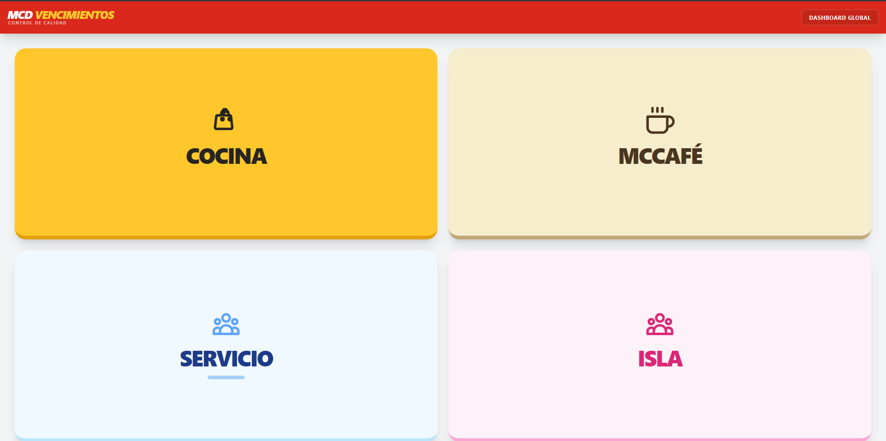
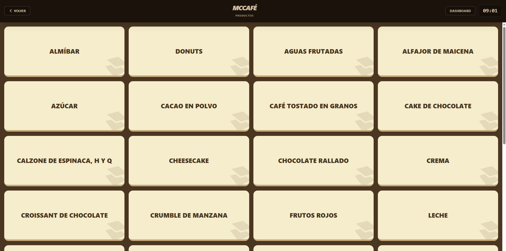
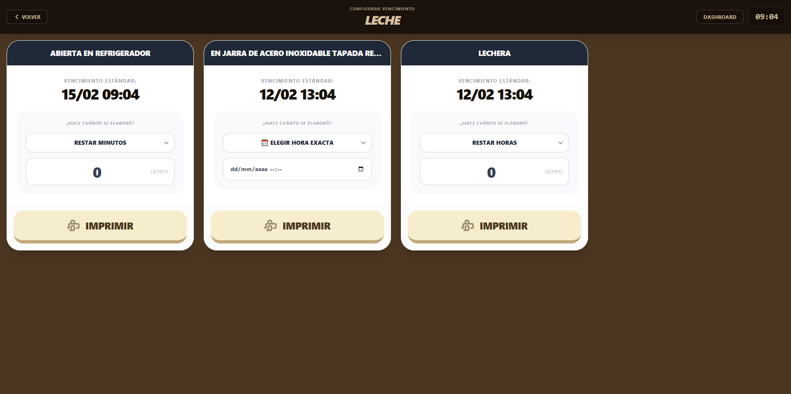
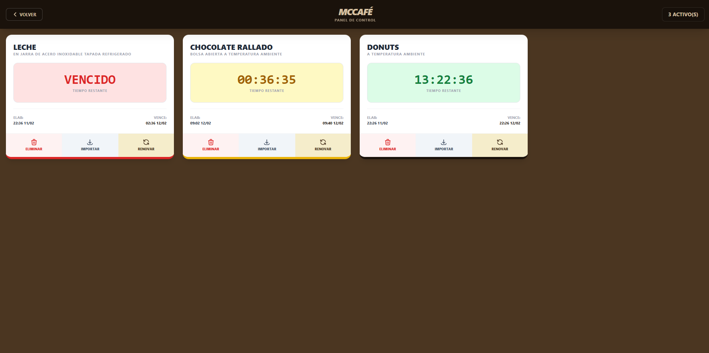
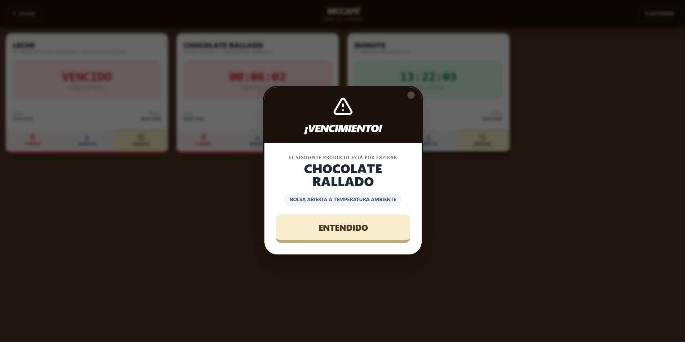
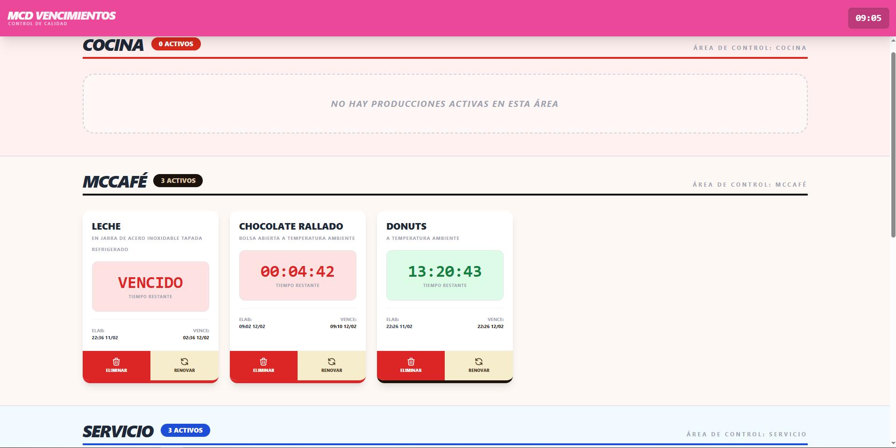
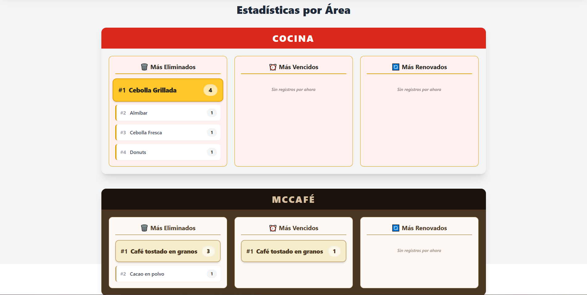

> **Solución Full Stack** diseñada para automatizar el control de vida útil secundaria, impresión de etiquetas y trazabilidad de productos en entornos de comida rápida de alta demanda.

---

<h2>📸 Galería y Flujo de Trabajo</h2>

<table>
  <tr>
    <td width="40%" valign="top">
      <h3>1. Navegación y Selección de Productos</h3>
      <p><strong>Interfaz Táctil Optimizada:</strong> Diseño modular con botones grandes para facilitar el uso en pantallas táctiles de cocina.</p>
      <ul>
        <li><strong>Categorización:</strong> Separación lógica por estaciones de trabajo (McCafé, Servicio, Cocina).</li>
        <li><strong>Catálogo Visual:</strong> Selección rápida de productos con indicadores visuales claros.</li>
      </ul>
    </td>
    <td width="60%">
      
      <br><br>
      
    </td>
  </tr>

  <tr>
    <td width="40%" valign="top">
      <h3>2. Motor de Reglas de Vencimiento</h3>
      <p><strong>Configuración Pre-Impresión:</strong> Antes de generar la etiqueta, el sistema permite ajustes finos.</p>
      <ul>
        <li><strong>Cálculo Automático:</strong> El sistema sugiere la hora exacta basada en las reglas del producto.</li>
        <li><strong>Ajuste Manual (Offset):</strong> Permite restar tiempo (horas/minutos) para compensar tiempos de descongelación o apertura previos.</li>
        <li><strong>Integración IoT:</strong> Al confirmar, se envía el comando RAW a la impresora térmica.</li>
      </ul>
    </td>
    <td width="60%">
      
    </td>
  </tr>

  <tr>
    <td width="40%" valign="top">
      <h3>3. Dashboard de Monitoreo en Tiempo Real</h3>
      <p><strong>Gestión Visual de Riesgos:</strong> Panel de control específico por sector.</p>
      <ul>
        <li><strong>Semáforo de Estados:</strong>
            <br>🟢 <strong>Seguro:</strong> > 45 mins.
            <br>🟡 <strong>Atención:</strong> < 45 mins.
            <br>🔴 <strong>Crítico:</strong> < 15 mins (Alerta Sonora).
        </li>
        <li><strong>Ordenamiento Prioritario:</strong> Los productos próximos a vencer suben automáticamente a la primera posición.</li>
      </ul>
    </td>
    <td width="60%">
      
      <br><br>
      
    </td>
  </tr>

  <tr>
    <td width="40%" valign="top">
      <h3>4. Centro de Comando Global</h3>
      <p><strong>Visión Unificada (Gerencial):</strong></p>
      <p>Permite a los gerentes supervisar todos los sectores desde una única pantalla, detectando cuellos de botella o pérdidas potenciales en cualquier área del restaurante simultáneamente.</p>
    </td>
    <td width="60%">
      
    </td>
  </tr>
<tr>
    <td width="40%" valign="top">
      <h3>5. Módulo de Analítica y Estadísticas</h3>
      <p><strong>Inteligencia de Negocio:</strong> Análisis histórico y detallado del ciclo de vida de los productos en cada área.</p>
      <ul>
        <li><strong>Métricas de Rendimiento:</strong>
            <br>🗑️ <strong>Más Eliminados:</strong> Productos consumidos que no requirieron reposición inmediata.
            <br>⏰ <strong>Más Vencidos:</strong> Alerta directa sobre productos no utilizados que se transformaron en desperdicio.
            <br>🔄 <strong>Más Renovados:</strong> Indicador de alta rotación; productos consumidos y repuestos constantemente.
        </li>
        <li><strong>Ranking Dinámico (Top 5):</strong> El sistema genera automáticamente un podio por categoría, destacando de forma visual los productos con mayor incidencia en el primer puesto.</li>
      </ul>
      <p><strong>Optimización Operativa:</strong> Permite a la gerencia identificar rápidamente patrones de desperdicio, evaluar la velocidad de rotación durante los turnos y tomar decisiones precisas basadas en datos para reducir costos de inventario.</p>
    </td>
    <td width="60%">
      
    </td>
  </tr>
</table>

---

## 🧠 Lógica y Desafíos Técnicos

Aunque la interfaz es sencilla para el operario, el backend gestiona lógica compleja:

* **Arquitectura de Impresión RAW:** El sistema no usa drivers de impresión del navegador. Envía comandos **ESC/POS directos** al puerto de la impresora local o de red para una velocidad instantánea (< 0.5s).
* **Relaciones N:N Complejas:** Un mismo `Producto` puede tener diferentes reglas según el `Sector` (Cocina/McCafé), resuelto mediante una base de datos relacional normalizada.
* **Gestión de Estado (Frontend):** Uso de **Delegación de Eventos** en JavaScript para manipular el DOM de múltiples temporizadores simultáneos sin degradar el rendimiento del navegador.
* **Sistema de Alias:** Configuración flexible que permite detectar cualquier impresora en la red simplemente asignándole el recurso compartido `"ticketera"`.

---


## 🛠️ Stack Tecnológico


* **Backend:** PHP 8, Laravel (Blade Templates).
* **Frontend:** JavaScript Vanilla (ES6+, DOM Manipulation, Fetch API), Tailwind CSS.
* **Servidor:** Apache (vía XAMPP).
* **Base de Datos:** MySQL.
* **Hardware:** Integración con impresoras térmicas ESC/POS.

---

## ⚙️ Requisitos de Instalación

Para correr este proyecto localmente necesitas:

1.  **PHP 8.1+** instalado.
2.  **Node.js & NPM**.
3.  **Composer**.
4.  **XAMPP** (o cualquier servidor con Apache y MySQL).
5.  **Drivers de Impresora:** Drivers genéricos o específicos de la marca de tu impresora POS instalados en el sistema operativo.

---

## 🔧 Configuración e Instalación

1.  **Clonar el repositorio:**
    ```bash
    git clone [https://github.com/Tahiel-Recchia/Mcd-vencimientos.git]
    cd Mcd-vencimientos
    ```

2.  **Instalar dependencias de Backend:**
    ```bash
    composer install
    ```

3.  **Instalar dependencias de Frontend:**
    ```bash
    npm install
    npm run build
    ```

4.  **Configurar Entorno:**
    * Duplica el archivo `.env.example` y renómbralo a `.env`.
    * Configura tus credenciales de base de datos en el archivo `.env`.

5.  **Base de Datos:**
    ```bash
    php artisan migrate --seed
    ```

6.  **⚠️ Configuración CRÍTICA de la Impresora:**
    * Para que el sistema de impresión funcione, debes compartir tu impresora en la red (o localmente) y **nombrarla obligatoriamente** como:
    * **Nombre del recurso compartido:** `ticketera`
    * *El sistema buscará este nombre específico para enviar los comandos RAW de impresión.*

7.  **Ejecutar:**
    * Inicia Apache y MySQL en XAMPP.
    * (Opcional) Usa el servidor de desarrollo de Laravel:
    ```bash
    php artisan serve
    ```

---

## 👤 Autor

**Tahiel Recchia**
* **Rol:** Desarrollador Full Stack
* [LinkedIn](https://www.linkedin.com/in/tahiel-recchia)
* [GitHub](https://github.com/Tahiel-Recchia)

---

> *Este proyecto fue desarrollado para optimizar procesos reales en un entorno de comida rápida, reduciendo el error humano y mejorando la seguridad alimentaria.*
